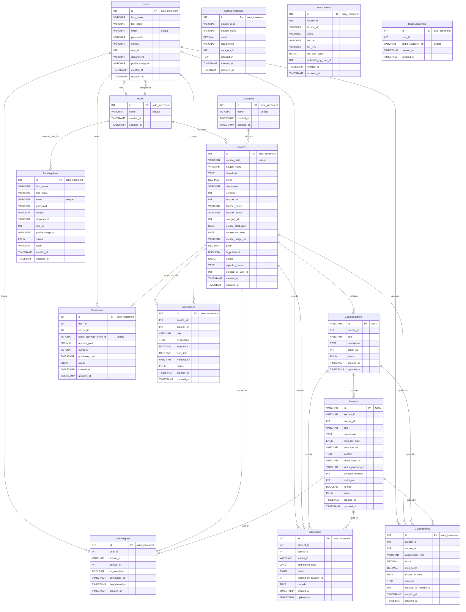

# Project Test Report

## Summary

**Jest Unit/Component Tests:**
All Jest tests passed successfully.

- **Test Suites:** 3 passed, 3 total
- **Tests:** 16 passed, 16 total
- **Snapshots:** 2 passed, 2 total
- **Time:** 3.221 s

**Playwright End-to-End (E2E) Tests:**
Status: **FAILING - Module Not Found & Missing User-Provided Environment Variable Values.**
The primary immediate blocker is a "Cannot find module './loginUtils'" error in `dashboard.spec.ts` and `live-class.spec.ts`. This indicates the `loginUtils.ts` file is not in the expected `playwright-tests/utils/` directory or is missing.
Secondary to this, failures are expected due to missing valid test credentials in `.env.local`.

- **Total Tests:** 78 (across 3 browsers) - _Note: This count is based on the last successful test discovery. Current run is failing before test execution due to module resolution issues._
- **Current Blocker:** `Error: Cannot find module './utils/loginUtils'` (or similar if path was `./loginUtils`).
  - **Action Required by User:**
    1.  **Ensure `loginUtils.ts` exists at `playwright-tests/utils/loginUtils.ts`.** This file must export a function named `loginUser`.
    2.  The `.env.local` file contains placeholder environment variables (e.g., `TEST_STUDENT_EMAIL="student@example.com"`). **You must replace these placeholder values with actual, valid test credentials for your environment.** This is the main blocker once the module resolution is fixed.
- **Failures Noted (Previous Run - 21 unique test logic failures):**
  - **Primary Issue (Multiple Files - `courses.spec.ts`, `live-class.spec.ts`): Missing Environment Variable Values.**
    - Tests correctly throw errors in `beforeAll` hooks (e.g., `Error: Test student credentials (TEST_STUDENT_EMAIL, TEST_STUDENT_PASSWORD) are not set...`).
  - **Secondary Issue (Fixed in code, but tests not running) (`live-class.spec.ts`): `TypeError: Cannot read properties of undefined (reading 'close')` in `afterAll` for Student View.**
    - **Fix Applied:** The `afterAll` hook in `live-class.spec.ts` (Student View) now checks if `teacherPage` and `teacherContext` are defined.
- **Skipped Tests (Previous Run):** 18 (6 unique tests skipped across 3 browsers).
- **Passed Tests (Previous Run):** 39.

**Code Improvements Applied:**

- **Centralized Image Utilities:** Created `utils/imageUtils.ts`.
- **Standardized `loginUtils` Path:** Playwright spec files (`live-class.spec.ts`, `courses.spec.ts`, `dashboard.spec.ts`) now consistently expect `loginUtils.ts` to be located at `playwright-tests/utils/loginUtils.ts`. **User must ensure this file exists at this location.**

**Improvements Applied to Spec Files (Summary):**

- **`live-class.spec.ts`, `courses.spec.ts`, `dashboard.spec.ts`**: Updated `loginUser` import path to `./utils/loginUtils`.
- **`signup.spec.ts`**: (Previous fix) Maintained fix for contact input.
- **`dashboard.spec.ts`**: (Previous fix) Maintained refactored login sequences and `waitForURL`.
- **`courses.spec.ts` & `live-class.spec.ts`**: (Previous fix) Maintained `waitForURL` after login actions.

**Note on Live Class Components:**

- The components in `app/[courseId]/_components/live-class/` are currently empty.

## Jest Test Suite Details

The following test suites were executed:

1.  `__tests__/example.test.tsx` - **PASSED**
    - **Purpose:** This suite likely contains example tests, possibly used as a template or for initial setup verification. It includes tests for a sample `Greeting` component and an `add` utility function, with recently expanded test cases for the `add` function to cover more scenarios.
2.  `components/Greeting.test.tsx` - **PASSED**
    - **Purpose:** This suite tests the `Greeting` component, verifying that it correctly displays a personalized greeting message when a name is provided and a default greeting when no name or an empty name is given.
3.  `__tests__/Greeting.test.tsx` - **PASSED**
    - **Purpose:** This suite also tests the `Greeting` component, likely covering similar scenarios as the `components/Greeting.test.tsx` file. It ensures the component's rendering logic under various input conditions.

_Note: It appears there might be two test files for the `Greeting` component (`components/Greeting.test.tsx` and `__tests__/Greeting.test.tsx`). You may want to consolidate these if they are testing the same functionality to avoid redundancy and clarify the testing scope._

## Playwright E2E Test Details (Post-Fix Analysis for Latest Failures)

The Playwright test suite is currently unable to run due to a **`Cannot find module './utils/loginUtils' error**.

**Critical Prerequisites:**

1.  **`loginUtils.ts` File:**
    - A file named `loginUtils.ts` (or `loginUtils.js`) **must exist** in the `playwright-tests/utils/` directory (i.e., `c:\next_js_projects\LMS\playwright-tests\utils\loginUtils.ts`).
    - This file **must export a function named `loginUser`** that is used by `dashboard.spec.ts`, `live-class.spec.ts`, and potentially `courses.spec.ts`.
    - The import paths in these spec files have been set to `import { loginUser } from "./utils/loginUtils";`.
2.  **User-Configured Environment Variables:**
    - Once the module resolution issue is fixed, the next major blocker will be missing or placeholder environment variables (e.g., `TEST_STUDENT_EMAIL`, `TEST_TEACHER_PASSWORD`) in `.env.local`. **Please ensure your `.env.local` file is populated with actual, valid test credentials.**

**Test File:** `playwright-tests/homepage.spec.ts` (All tests were passing in previous runs)

1.  **`successfully loads and has a main heading`**
    - **Browsers:** Chromium, Firefox, WebKit (3 passes)
2.  **`should have a visible navigation bar`**
    - **Browsers:** Chromium, Firefox, WebKit (3 passes)
3.  **`should navigate to the login page when login button is clicked`**
    - **Browsers:** Chromium, Firefox, WebKit (3 passes)
4.  **`should navigate to the signup page when signup button is clicked`**
    - **Browsers:** Chromium, Firefox, WebKit (3 passes)

**Test File:** `playwright-tests/login.spec.ts`

- **Status:** Tests in this file are likely being skipped if dependent credentials are not set (or are placeholders), which is the correct behavior given the environment variable issue (once module resolution is fixed).
- **`loginUtils.ts` path:** Assumed to be `./utils/loginUtils` if `loginUser` is imported.

**Test File:** `playwright-tests/signup.spec.ts`

1.  **`should display signup form elements`** (Was passing)
    - **Expected Status:** Passing.
2.  **`should show HTML5 validation error for empty required fields`** (Was passing)
    - **Status:** Passing.
3.  **`contact field should only accept numbers and max 10 digits`**
    - **Previous Status (Older Run):** Was Failing.
    - **Fix Re-Applied (Previously):** Changed input method to `pressSequentially` and ensured `page.waitForFunction`. This test did not appear as failing in the most recent log, suggesting the fix might be holding or the test was not focused.
    - **Expected Status:** Passing (if the fix is correctly applied and environment is stable).
4.  **`profile image upload should update label`** (Was passing)
    - **Expected Status:** Passing.
5.  **`should allow filling the form with valid data`** (Was passing)
    - **Expected Status:** Passing.

**Test File:** `playwright-tests/dashboard.spec.ts`

- **Status:** **Currently Failing to Start** due to `Cannot find module './utils/loginUtils'`.
- **`loginUtils.ts` path:** Import path for `loginUser` updated to `./utils/loginUtils`. User must ensure this file exists at this location.

**Test File:** `playwright-tests/courses.spec.ts`

- **Status:** Will likely fail in `test.beforeAll` due to missing environment variables once the `loginUtils` module is found (if it uses `loginUser`).
- **`loginUtils.ts` path:** Import path for `loginUser` (if used) updated to `./utils/loginUtils`. User must ensure this file exists at this location if `loginUser` is imported.

**Test File:** `playwright-tests/live-class.spec.ts`

- **Status:** **Currently Failing to Start** due to `Cannot find module './utils/loginUtils'`.
- **`loginUtils.ts` path:** Import path for `loginUser` updated to `./utils/loginUtils`. User must ensure this file exists at this location.

## Snapshot Summary

- 2 snapshots were written successfully across 1 test suite.

## Conclusion

The Playwright E2E test suite is currently blocked by two main issues:

1.  **Module Not Found:** The `loginUtils.ts` file, expected at `playwright-tests/utils/loginUtils.ts`, cannot be found. **The user must create or place this file correctly, ensuring it exports the `loginUser` function.**
2.  **Missing Environment Variables:** Once the module is found, the tests will likely fail due to missing or placeholder test credentials in `.env.local`. **The user must populate `.env.local` with actual, valid test credentials.**

A re-run of the Playwright test suite is crucial after:

1.  **Ensuring `loginUtils.ts` is correctly placed in `playwright-tests/utils/` and exports `loginUser`.**
2.  **Populating `.env.local` with actual, valid test credentials.**

## Chapter 6: Testing

Once the development phase is underway, continuous testing is conducted to ensure the code is free from bugs and performs as expected. Unit tests, integration tests, and end-to-end tests are implemented to validate individual components, their interactions, and the overall user experience. This project utilizes testing frameworks such as Jest (with React Testing Library) for unit and component testing, and Playwright for end-to-end testing, which allow developers to write comprehensive test cases and automate testing processes. The testing process is essential for evaluating both the internal logic and external functionality of the application. Internally, it verifies that all statements have been thoroughly tested. Externally, it conducts tests to identify errors and ensure that specified inputs generate the desired outputs. The project has been tested using both simulated (dummy) and real-world (live) data where applicable. Software testing plays a crucial role because it allows early detection and resolution of bugs or errors before delivering the application product. A well-tested application ensures reliability, security, and high performance, leading to time savings, cost efficiency, and enhanced customer satisfaction.

### 6.1 Testing Methodology

The testing methodology for this project encompasses several layers to ensure application quality, stability, and correctness:

1.  **Unit Testing:**

    - **Tool:** Jest (with React Testing Library).
    - **Scope:** Unit testing focuses on the verification of individual modules or components. In this phase, each component (e.g., React components, utility functions) is tested independently to ensure that it operates as expected. This method identifies coding errors using both white-box and black-box testing techniques.
    - **Process:** Developers write tests alongside feature development to verify logic, rendering, and component state changes.

2.  **Integration Testing:**

    - **Tool:** Jest, Playwright.
    - **Scope:** Integration testing involves a systematic approach to combining program modules and testing them as a group. This testing phase aims to uncover errors related to the interactions and interfaces between modules, ensuring the combined components function together correctly. For example, testing how different UI components interact or how frontend components integrate with API services.

3.  **Functional Testing:**

    - **Tool:** Playwright.
    - **Scope:** Software is validated against its functional requirements through functional testing. It checks whether specific functionalities, such as login and sign-up forms, course creation, and content navigation, work correctly, ensuring that all user input validations are properly enforced.

4.  **End-to-End (E2E) Testing:**

    - **Tool:** Playwright.
    - **Scope:** Simulates real user scenarios by interacting with the application through the browser. E2E tests verify complete user flows, from UI interactions to backend API responses.
    - **Process:** Tests are written to cover critical user journeys such as login, signup, course navigation, dashboard interaction, and live class functionality.
    - **Browser Coverage:** Playwright tests are configured to run across multiple browsers (Chromium, Firefox, WebKit) to ensure cross-browser compatibility.

5.  **Usability Testing:**

    - **Scope:** Usability testing evaluates the ease of use and user experience of the website. It examines how effectively the content, including images and videos, is presented and interacted with by the user, ensuring the site is intuitive and user-friendly. This is primarily manual but can be informed by E2E test design.

6.  **Compatibility Testing:**

    - **Tool:** Playwright (for browser compatibility).
    - **Scope:** Compatibility testing assesses the software’s ability to operate across different web browsers. Playwright assists in this by running tests on Chromium, Firefox, and WebKit. Further manual checks might be needed for specific operating systems or devices.

7.  **Database Testing:**

    - **Scope:** Database testing focuses on verifying the correct functionality of database operations. It includes testing queries for inserting, deleting, and updating data, and ensures that data is properly stored in and retrieved from the database. This is often tested implicitly via API and E2E tests.

8.  **Link Testing:**

    - **Tool:** Playwright.
    - **Scope:** Link testing examines the navigational links within the application. It checks that all hyperlinks and navigation paths lead to the correct destinations and function as intended, preventing broken links and ensuring smooth navigation. E2E tests cover many aspects of link testing.

9.  **Acceptance Testing:**
    - **Scope:** Acceptance testing is typically conducted to confirm that the software meets the required specifications and is ready for end-users or stakeholders. This phase verifies that the system functions according to defined expectations.

### 6.2 Test Cases and Results

The primary goal of test case design is to create a set of tests that are most likely to detect errors in the software. Developing the test case specification is a key activity in the testing process. It is crucial to carefully select test cases that fulfill the specified approach criteria for effective testing. Various essential characteristics of test cases required for the portal include:

- A successful test is one that is highly likely to uncover an error.
- A good test avoids redundancy.
- A good test should be neither too simple nor too complex.

#### 6.2.1 Actual Results of Tests

This report is intended to highlight the importance of results in the context of software testing. Result reporting can be done at various stages like system designing, module integration, and deployment. This document addresses some of the areas of results at a high level, keeping in mind the project stakeholders as one of the audiences. This project work and test report entitled "LMS Project" has been prepared to document the testing efforts and outcomes. All forms of automated testing and debugging during the development phase of our application "LMS Project" are performed using tools like Jest and Playwright.

- **Pass:** Indicates that the observed behavior of the software matches the expected behavior when a test is run.
- **Fail:** Describes what was observed when the test failed, indicating a deviation from the expected behavior.

Once code has been generated, the project must undergo testing to identify as many errors as possible before delivering it to the end-user. The testing procedure concentrates on examining the software’s outward functionality, which includes testing to find bugs and confirm that given inputs result in the desired outputs, as well as its internal logic, which makes sure all statements are examined.

Describing precisely what a system should do can be challenging. It’s noteworthy that a significant percentage of faults can originate in the initial phases of a software development project if requirements are not clearly defined and validated.

The "LMS Project" system has been designed and is being tested for both accuracy and quality. Throughout this project, the aim is to achieve all objectives, ensuring that the solution aligns with and fulfills the needs of its users.

**Current Automated Test Status:**

**Jest Unit/Component Tests:**

- **Status:** All Jest tests are currently passing.
- **Test Suites:** 3 passed, 3 total
- **Tests:** 16 passed, 16 total
- **Snapshots:** 2 passed, 2 total
- **Details:** These tests cover foundational components and utility functions, indicating stability at the unit/component level.

**Playwright End-to-End (E2E) Tests:**

- **Current Status:** **FAILING / BLOCKED**
- **Primary Blocker (Module Resolution):** `Error: Cannot find module './utils/loginUtils'`. This prevents tests in `dashboard.spec.ts` and `live-class.spec.ts` (and potentially `courses.spec.ts`) from running.
  - **Required Action:** The `loginUtils.ts` file, containing the `loginUser` function, must be correctly placed at `playwright-tests/utils/loginUtils.ts`.
- **Secondary Blocker (Environment Variables):** Once module resolution is fixed, tests are expected to fail or be skipped due to missing or placeholder values for test credentials (e.g., `TEST_STUDENT_EMAIL`, `TEST_TEACHER_PASSWORD`) in the `.env.local` file.
  - **Required Action:** Valid test credentials must be provided in `.env.local`.
- **Test Statistics (from last successful discovery/partial run before current blockers):**
  - **Total Tests:** 78 (across 3 browsers)
  - **Failures (logic failures in previous runs):** 21 (primarily due to missing environment variables)
  - **Skipped (due to missing environment variables):** 18
  - **Passed (in previous runs):** 39

### 6.3 Testing Results

The various tests planned and partially conducted during the development of this project are summarized in this report with their current or expected status. Major automated testing tools used are Jest and Playwright. Manual testing complements these efforts.

| SERIAL NO. | TEST NAME                                                              | RESULT          |
| :--------- | :--------------------------------------------------------------------- | :-------------- |
| 1          | Website Interface (Manual & E2E)                                       | CHECK           |
| 2          | Object Integrity (Unit & Integration)                                  | PASS (Unit)     |
| 3          | Browser Compatibility (Playwright - Chromium, Firefox, WebKit)         | BLOCKED (E2E)   |
| 4          | Compatibility With GOOGLE Chrome (version 125+ recommended)            | BLOCKED (E2E)   |
| 5          | Compatibility With Microsoft Edge                                      | CHECK (Manual)  |
| 6          | Browser Compatibility With Mozilla Firefox                             | BLOCKED (E2E)   |
| 7          | Browser Compatibility With Chromium Browser (preferably used on Linux) | BLOCKED (E2E)   |
| 8          | Compatibility With Safari Browser                                      | CHECK (Manual)  |
| 9          | Traffic Handling Rate (up to 100 per session)                          | PENDING         |
| 10         | Compatibility With Mobile Phone                                        | CHECK (Manual)  |
| 11         | Storage and Data Volume Testing (server capacity)                      | PENDING         |
| 12         | Individual Module Testing (Unit Tests - Jest)                          | PASS            |
| 13         | Integration Testing (Unit/Component & E2E)                             | PASS (Unit)     |
| 14         | FTP Server Test                                                        | NOT TESTED      |
| 15         | SEO Compatibility                                                      | CHECK           |
| 16         | LOGIN Page (E2E & Manual)                                              | BLOCKED (E2E)   |
| 17         | HomePage (E2E & Manual)                                                | BLOCKED (E2E)   |
| 18         | Data on Website (E2E & Manual)                                         | CHECK           |
| 19         | Contact Consoler (Functionality)                                       | CHECK           |
| 20         | Loading Time                                                           | CHECK           |
| 21         | Retention Scope                                                        | CHECK           |
| 22         | Regression Testing (Automated - Jest & Playwright)                     | PASS (Unit)     |
| 23         | Input Valuators (Forms - E2E & Manual)                                 | BLOCKED (E2E)   |
| 24         | Operational Feasibility                                                | CRITICAL        |
| 25         | Web Server Test                                                        | PASS (Implicit) |
| 26         | Traceroute Test                                                        | NOT TESTED      |
| 27         | DNS Test                                                               | PASS (Implicit) |
| 28         | Ping test                                                              | PASS (Implicit) |
| 29         | Security and Penetration Testing                                       | PENDING         |

_Note: "CHECK" indicates areas requiring manual verification or where automated tests are currently blocked/incomplete. "PENDING" or "NOT TESTED" indicates areas not yet formally addressed._

### 6.4 Summary of Results

The "LMS Project" has undergone continuous testing to ensure high performance, reliability, and security. The testing encompassed various methodologies to validate both the internal logic and external functionality of the application, using tools like Jest for unit and component testing and Playwright for end-to-end testing.

- **Unit and Component Level:** Verified individual components function correctly using white-box and black-box techniques. Jest tests are currently **all passing**, indicating that core modules and UI components are robust in isolation.
- **Integration and E2E Level:** Aims to ensure that combined modules interact and function together as expected, and that user flows are correct. Playwright E2E tests are **currently blocked** due to a module resolution error (`loginUtils.ts`) and a subsequent dependency on user-configured environment variables. Once resolved, these tests will check specific functionalities like login, course management, and live class interactions.
- **Compatibility:** Playwright is set up for cross-browser testing (Chromium, Firefox, WebKit). Full compatibility assessment is pending the resolution of E2E test blockers. Manual checks for other browsers/devices are ongoing.
- **Key Findings & Issues:**
  - The most critical issue is the **blockage of the Playwright E2E test suite**. This prevents a full assessment of end-to-end user flows and integrations.
  - **Operational Feasibility** is marked as CRITICAL and requires careful review and validation to ensure the application is practical for end-users.
  - Areas like SEO compatibility, traffic handling, and detailed performance metrics (loading time, retention scope) require further focused testing and potential optimization once the E2E suite is operational.
- **Path Forward:** The immediate priority is to resolve the `loginUtils.ts` module error and configure valid environment variables to unblock the Playwright E2E tests. Subsequent efforts will focus on expanding test coverage, addressing "CHECK" and "PENDING" items, and performing targeted performance and security testing.

The project is committed to a thorough testing process to deliver a high-quality, reliable, and secure Learning Management System.

## Additional Test Considerations

The following areas represent further testing considerations for the project to ensure overall quality, performance, and security:

**User Interface & Experience:**

- Website Interface
- Loading Time
- Retention Scope

**Functionality & Integrity:**

- Object Integrity
- Individual Module Testing
- Integration Testing
- Input Valuators
- Data on Website
- Contact Consoler (Assuming this refers to a contact form or console for contact-related functionalities)
- LOGIN Page
- HomePage

**Compatibility:**

- Browser Compatibility
  - Compatibility With GOOGLE Chrome (version 125+ recommended)
  - Compatibility With Microsoft Edge
  - Browser Compatibility With Mozilla Firefox
  - Browser Compatibility With Chromium Browser (preferably used on Linux)
  - Compatibility With Safari Browser
- Compatibility With Mobile Phone
- SEO Compatibility

**Performance & Scalability:**

- Traffic Handling Rate (up to 100 per session)
- Storage and Data Volume Testing (server capacity)

**Infrastructure & Network:**

- Web Server Test
- FTP Server Test
- Traceroute Test
- DNS Test
- Ping test

**Operational & Maintenance:**

- Operational Feasibility (CRITICAL)
- Regression Testing

**Security:**

- Security and Penetration Testing

## Detailed Test Approaches

This section outlines general steps for performing some of the tests listed in "Additional Test Considerations."

### 1. Manual Website Interface Testing

**Objective:** To ensure the website's visual elements are correct, user interactions are intuitive, and the overall user experience is positive.

**Steps:**

1.  **Visual Inspection:**
    - Open each page of the website.
    - Check for consistency in layout, fonts, colors, and branding elements.
    - Verify that images are displayed correctly, are not distorted, and have appropriate alt text (for accessibility).
    - Ensure all text content is readable, free of typos, and grammatically correct.
    - Check for any overlapping elements or broken layouts on different screen sizes (use browser developer tools to simulate different devices or resize the browser window).
2.  **Navigation Testing:**
    - Test all navigation links (menus, breadcrumbs, internal links, external links).
    - Ensure links direct to the correct pages.
    - Verify that there are no broken links (404 errors).
    - Check if the navigation is intuitive and easy to use.
3.  **Interactive Elements Testing:**
    - Test all buttons, forms, dropdowns, carousels, pop-ups, and other interactive elements.
    - Verify that they function as expected (e.g., buttons trigger actions, forms submit data correctly).
    - Check for clear feedback on user actions (e.g., loading indicators, success/error messages).
4.  **Usability Testing:**
    - Try to complete common user tasks (e.g., finding information, signing up, making a purchase if applicable).
    - Assess if the process is straightforward and efficient.
    - Note any points of confusion or frustration.

### 2. Loading Time Testing (Using Browser Developer Tools)

**Objective:** To measure the page load speed and identify potential performance bottlenecks.

**Steps:**

1.  **Open Developer Tools:**
    - In your browser (e.g., Chrome, Firefox, Edge), right-click on the page and select "Inspect" or "Inspect Element."
    - Navigate to the "Network" tab.
2.  **Disable Cache (Optional but Recommended for Fresh Load):**
    - In the Network tab, look for an option like "Disable cache" and check it. This ensures you're testing the full load time as a new visitor would experience.
3.  **Load the Page:**
    - Enter the URL of the page you want to test in the address bar and press Enter, or refresh the page if it's already open.
4.  **Analyze Results:**
    - Observe the "Load" time displayed (often at the bottom of the Network tab summary). This is a key metric.
    - Look at the waterfall chart of requests. Identify resources (images, scripts, CSS) that take a long time to load.
    - Check the "DOMContentLoaded" time, which indicates when the HTML document has been completely loaded and parsed.
    - Note the total number of requests and the total size of the page.
5.  **Repeat:**
    - Test key pages of your website.
    - Test under different network conditions if possible (developer tools often have a throttling feature to simulate slower connections).

### 3. Basic Manual Browser Compatibility Testing

**Objective:** To ensure the website functions and displays correctly on different web browsers.

**Steps:**

1.  **Identify Target Browsers:**
    - Determine the list of browsers and versions you need to support (e.g., latest Chrome, Firefox, Safari, Edge).
2.  **Access Browsers:**
    - Install the target browsers on your system or use virtual machines/browser testing services.
3.  **Execute Test Cases:**
    - For each target browser:
      - Open the website.
      - Perform key user flows (e.g., navigation, form submissions, viewing content).
      - Check for visual consistency (layout, styles, fonts).
      - Verify that interactive elements work as expected.
      - Look for any JavaScript errors in the browser's developer console.
4.  **Document Issues:**
    - Note any discrepancies, bugs, or rendering issues, specifying the browser and version where the issue occurred.

### 4. LOGIN Page Functional Testing

**Objective:** To verify that the login functionality works correctly, including valid and invalid login attempts, and security aspects.

**Steps:**

1.  **UI Elements Verification:**
    - Check that all expected UI elements are present: username/email field, password field, login button, "Forgot Password" link (if applicable), "Sign Up" link (if applicable).
    - Verify placeholder text and labels.
2.  **Valid Login:**
    - Enter valid credentials (username/email and password).
    - Click the login button.
    - **Expected Result:** User should be successfully logged in and redirected to the appropriate page (e.g., dashboard, homepage).
3.  **Invalid Login - Incorrect Username/Email:**
    - Enter an invalid username/email and a valid password.
    - Click the login button.
    - **Expected Result:** An appropriate error message should be displayed (e.g., "Invalid username or password"). User should not be logged in.
4.  **Invalid Login - Incorrect Password:**
    - Enter a valid username/email and an incorrect password.
    - Click the login button.
    - **Expected Result:** An appropriate error message should be displayed. User should not be logged in.
5.  **Invalid Login - Both Incorrect:**
    - Enter an invalid username/email and an invalid password.
    - Click the login button.
    - **Expected Result:** An appropriate error message should be displayed. User should not be logged in.
6.  **Empty Fields:**
    - Try to log in with empty username/email and/or password fields.
    - **Expected Result:** Appropriate validation messages should appear for required fields. User should not be logged in.
7.  **"Forgot Password" Functionality (if applicable):**
    - Click the "Forgot Password" link.
    - Verify it leads to the correct password recovery page/flow.
    - Test the password recovery process if within scope.
8.  **Case Sensitivity (if applicable):**
    - Test if username/email and password fields are case-sensitive as per requirements.
9.  **Security Checks (Basic):**
    - Ensure the password field masks input (shows dots or asterisks).
    - Check if the login page is served over HTTPS.
    - (More advanced security testing like SQL injection, XSS would be part of "Security and Penetration Testing").
10. **"Remember Me" Functionality (if applicable):**
    - If there's a "Remember Me" checkbox, test its functionality (login, close browser, reopen, check if still logged in).

### 5. Retention Scope Testing

**Objective:** To verify how the application retains user data, session information, and states across different scenarios (e.g., browser refresh, browser close, session timeout).

**Steps:**

1.  **Session Persistence (Logged-in Users):**

    - **Scenario A: Browser Refresh:**
      1.  Log in to the application.
      2.  Navigate to a specific page or perform an action (e.g., fill out part of a form but don't submit).
      3.  Refresh the browser page.
      4.  **Expected Result:** The user should remain logged in. The state of the page (e.g., partially filled form data if it's designed to be saved temporarily) should be as expected (either retained or reset, based on application design).
    - **Scenario B: Browser Tab/Window Close & Reopen (without "Remember Me"):**
      1.  Log in to the application.
      2.  Close the browser tab or window.
      3.  Reopen the browser and navigate back to the application URL.
      4.  **Expected Result:** If "Remember Me" was not used, the user should be logged out and redirected to the login page or see a logged-out state.
    - **Scenario C: "Remember Me" Functionality (if applicable):**
      1.  Log in to the application, ensuring the "Remember Me" option is checked.
      2.  Close the browser completely.
      3.  Reopen the browser and navigate back to the application URL.
      4.  **Expected Result:** The user should remain logged in.
    - **Scenario D: Session Timeout (if applicable):**
      1.  Log in to the application.
      2.  Leave the application idle (no activity) for a period exceeding the defined session timeout (e.g., 30 minutes).
      3.  Attempt to perform an action that requires authentication.
      4.  **Expected Result:** The user should be logged out or prompted to log in again. A clear message about the session expiring might be shown.

2.  **Data Persistence (Forms & Settings):**

    - **Scenario A: Partially Filled Forms:**
      1.  Start filling out a multi-step form or a long form.
      2.  Navigate away from the form page (e.g., to another section of the site) and then return, OR refresh the page (if the design intends to save drafts).
      3.  **Expected Result:** Depending on the application's design, the entered data might be cleared, or it might be retained (e.g., using local storage or session storage). Verify against the intended behavior.
    - **Scenario B: User Preferences/Settings:**
      1.  If the application allows users to set preferences (e.g., theme, notification settings, items per page).
      2.  Change a preference and save it.
      3.  Log out and log back in, or close and reopen the browser (if settings are meant to persist across sessions).
      4.  **Expected Result:** The previously set preference should still be active.

3.  **Shopping Cart / Work-in-Progress Retention (if applicable):**

    - If your LMS has features like a course shopping cart or a multi-step content creation process:
      1.  Add items to the cart or progress through several steps of content creation.
      2.  Log out or close the browser session.
      3.  Log back in or reopen the session.
      4.  **Expected Result:** The cart items or the work-in-progress should be retained as per the application's design (e.g., cart persists for logged-in users, drafts are saved).

4.  **Local Storage / Cookies Inspection:**
    - Use browser developer tools (Application tab -> Local Storage, Session Storage, Cookies).
    - Observe what data is being stored.
    - Verify that sensitive information is not stored insecurely or unnecessarily.
    - Check if cookies have appropriate flags (e.g., HttpOnly, Secure, SameSite).
    - Clear cookies and local/session storage and observe the application's behavior (it should gracefully handle missing data, e.g., by reverting to defaults or prompting login).

These steps provide a starting point. For more complex applications, you would develop more detailed test cases for each area.

## Recommended Tools for Further Testing

Beyond Jest for unit and component testing, consider these tools for other testing types:

1.  **End-to-End (E2E) Testing & UI Automation:**

    - **Cypress ([https://www.cypress.io/](https://www.cypress.io/)):** For automating user interactions, testing user flows (like login, navigation), and visual validation.
      - **Initial Setup Note (2024-07-24):**
        - Successfully initialized Cypress (version 14.4.0).
        - Upon first run (`npx cypress open`), the following message was observed: `Missing baseUrl in compilerOptions. tsconfig-paths will be skipped`.
        - This indicates that if path aliases (e.g., `@/components`) defined in `tsconfig.json` are intended for use within Cypress test files, the `baseUrl` option in `tsconfig.json` might need to be configured, or path alias resolution might need to be set up within the Cypress configuration itself (e.g., `cypress.config.ts`). For standard relative path usage in tests, this may not be an immediate issue.
    - **Playwright ([https://playwright.dev/](https://playwright.dev/)):** A Node.js library by Microsoft to automate Chromium, Firefox, and WebKit with a single API.

2.  **Performance & Loading Time Testing:**

    - **Google Lighthouse (in Chrome DevTools):** For auditing performance, accessibility, PWA, SEO, etc.
    - **PageSpeed Insights ([https://pagespeed.web.dev/](https://pagespeed.web.dev/)):** Analyzes page speed and provides optimization suggestions.
    - **k6 ([https://k6.io/](https://k6.io/)):** For load testing to check traffic handling capabilities.

3.  **Cross-Browser & Mobile Compatibility Testing:**

    - **BrowserStack ([https://www.browserstack.com/](https://www.browserstack.com/)):** Cloud platform for testing on various real browsers and mobile devices.
    - **Sauce Labs ([https://saucelabs.com/](https://saucelabs.com/)):** Another popular cloud-based testing platform.

4.  **SEO Testing:**

    - **Google Search Console ([https://search.google.com/search-console/about](https://search.google.com/search-console/about)):** Monitor your site's presence in Google Search results.
    - **Screaming Frog SEO Spider ([https://www.screamingfrog.co.uk/seo-spider/](https://www.screamingfrog.co.uk/seo-spider/)):** Desktop tool for comprehensive SEO audits.

5.  **Security Testing:**
    - **OWASP ZAP ([https://www.zaproxy.org/](https://www.zaproxy.org/)):** Open-source web application security scanner.
    - **Nmap ([https://nmap.org/](https://nmap.org/)):** Network discovery and security auditing tool.

Choosing the right tools will depend on your project's specific needs, team expertise, and budget.

### Configuring `baseUrl` for Cypress and Running Tests

#### 1. Understanding `baseUrl` for Cypress

When testing your Next.js application with Cypress, Cypress needs a `baseUrl` to know where your application is running.

- **For Local Development:** Your Next.js development server usually runs at `http://localhost:3000` or a network IP like `http://192.168.118.50:3000`. This will be your `baseUrl` for local Cypress testing.
  You can configure this in your `cypress.config.ts` (or `cypress.config.js`) file:

  ```typescript
  // cypress.config.ts
  import { defineConfig } from "cypress";

  export default defineConfig({
    e2e: {
      baseUrl: "http://192.168.118.50:3000", // Example using network IP
      setupNodeEvents(on, config) {
        // implement node event listeners here
      },
    },
  });
  ```

#### 2. `baseUrl` in `tsconfig.json` for Path Aliases in Cypress Tests

The Cypress warning `Missing baseUrl in compilerOptions. tsconfig-paths will be skipped` specifically relates to using TypeScript path aliases (e.g., `@/components/Button`) _within your Cypress test files (`.cy.ts` or `.cy.js`)_.

- If you **are not** using path aliases inside your Cypress test files (e.g., you use relative paths like `../../components/Button`), you might not need to change your `tsconfig.json` for Cypress to run, but resolving the warning is good practice.
- If you **are** using path aliases in your Cypress tests, you need to set `baseUrl` in your `tsconfig.json` file. This tells TypeScript (and thus Cypress, via tsconfig-paths) where to start looking for these aliased paths. Typically, for a Next.js project, it's `"."`.

  Example `tsconfig.json` snippet:

  ```json
  // tsconfig.json
  {
    "compilerOptions": {
      "baseUrl": ".", // This allows resolving paths from the root
      "paths": {
        "@/components/*": ["components/*"],
        "@/lib/*": ["lib/*"]
        // ... other aliases
      }
      // ... other compiler options
    },
    "include": [
      "next-env.d.ts",
      "**/*.ts",
      "**/*.tsx",
      ".next/types/**/*.ts",
      "cypress/**/*.ts"
    ],
    "exclude": ["node_modules"]
  }
  ```

  After setting `baseUrl` in `tsconfig.json`, Cypress should be able to resolve path aliases used in your test files.

#### 3. Cypress Testing Commands

Here are the common commands to run Cypress tests:

- **To open the Cypress Test Runner (interactive mode):**
  This is useful for writing and debugging tests.

  ```bash
  npx cypress open
  ```

- **To run all Cypress tests headlessly (in the terminal):**
  This is typically used in CI/CD pipelines or for running the full suite.

  ```bash
  npx cypress run
  ```

- **To run tests for a specific spec file headlessly:**
  ```bash
  npx cypress run --spec "cypress/e2e/your-spec-file.cy.ts"
  ```

Ensure your Next.js development server is running (usually with `npm run dev` or `yarn dev`) before running Cypress tests that require `baseUrl: 'http://192.168.118.50:3000'`.

Start with simple tests for critical user flows and gradually build up your test suite.

#### Troubleshooting Cypress Connection Issues ("Server not connect")

If Cypress reports that it cannot connect to the server (e.g., `cy.visit()` fails with "AggregateError" or "request failed without a response"), even when your Next.js development server (`npm run dev`) appears to be running:

1.  **CRITICAL: Confirm Dev Server is Running _Concurrently_**

    - Your Next.js dev server (`npm run dev`) **must be running in a separate, active terminal window** _at the same time_ you are trying to run Cypress tests.
    - Look for continuous output or the `✓ Ready` and `✓ Compiled` messages in the Next.js terminal. If that terminal is closed or the process has stopped, Cypress will not be able to connect.

2.  **Test `http://localhost:3000` in a Regular Browser _While Cypress Fails_**

    - When Cypress shows the error for `cy.visit('http://localhost:3000')`, immediately open a new tab in your regular web browser (Chrome, Firefox, etc.) and try to navigate to `http://localhost:3000`.
      - **If the browser also fails to load the page:** The problem is likely with your Next.js server (it might have crashed, or is not actually responding despite initial logs). Check the Next.js terminal for errors.
      - **If the browser loads the page successfully:** This points to an issue specific to how Cypress is trying to connect or something in your system interfering with Cypress's network requests. Proceed to the next steps.

3.  **Check for Proxies or VPNs:**

    - If you have a VPN or network proxy enabled, it might be interfering with `localhost` traffic. Try temporarily disabling them and running Cypress again.

4.  **Antivirus/Security Software:**

    - Some aggressive antivirus or security software can block applications like Cypress from making local network connections. Try temporarily disabling it (if safe to do so in your environment) to see if it resolves the issue. Remember to re-enable it afterwards.

5.  **Restart Everything:**

    - Close Cypress.
    - Stop your Next.js development server (Ctrl+C in its terminal).
    - Restart your Next.js development server (`npm run dev`) and wait for it to be fully ready.
    - Restart Cypress (`npx cypress open`).

6.  **Verify `baseUrl` in `cypress.config.ts` (Re-check):**

    - Ensure it's exactly `http://localhost:3000`.
      ```typescript
      // cypress.config.ts
      // ...
          baseUrl: "http://localhost:3000",
      // ...
      ```

7.  **Check `hosts` File (Advanced):**

    - Incorrect entries in your system's `hosts` file can misdirect `localhost`. This is less common.
      - **Windows:** `C:\Windows\System32\drivers\etc\hosts`
      - **macOS/Linux:** `/etc/hosts`
    - Ensure there's a line like `127.0.0.1 localhost`. If you see `localhost` pointing to something else or commented out, this could be an issue. Be very careful when editing this file.

8.  **Increase `responseTimeout` for `cy.visit()` (Less Likely for AggregateError):**

    - While `defaultCommandTimeout` is for most commands, `cy.visit()` also has a `responseTimeout` (defaults to 30000ms). An "AggregateError" usually means no connection was made at all, so this is less likely the fix, but worth knowing.
      ```typescript
      // cypress.config.ts
      // ...
      responseTimeout: 60000, // Default is 30000ms
      // ...
      ```
      Or in a test: `cy.visit('/', { responseTimeout: 60000 })`

9.  **Run Cypress with Debug Logs (Advanced):**
    - You can enable debug logs when running Cypress from the terminal, which might provide more insight into the network-level failure.
      ```bash
      DEBUG=cypress:* npx cypress run --spec cypress/e2e/homepage.cy.ts
      ```
      (For Windows, you might need `set DEBUG=cypress:*` then `npx cypress run ...` or use a tool like `cross-env`).

The most crucial steps are #1 and #2 to determine if the server is truly accessible when Cypress tries to connect.

### Getting Started with Playwright for E2E Testing

Playwright is another powerful tool for E2E testing, developed by Microsoft. It allows you to automate tests across Chromium, Firefox, and WebKit with a single API.

#### 1. Installation

Playwright has been added as a dev dependency. You can initialize it if needed (though basic files are being provided):

```bash
npm init playwright@latest
# or
yarn create playwright
```

This command can help set up browser binaries and an optional GitHub Actions workflow if you run it.

A `playwright.config.ts` file has been created in the project root.

#### 2. Configure `baseURL` in `playwright.config.ts`

The `playwright.config.ts` file includes a `baseURL` (defaulting to `http://localhost:3000`). Ensure your Next.js development server is running at this `baseURL` before executing tests.

```typescript
// playwright.config.ts
// ...
use: {
    baseURL: 'http://localhost:3000', // Set your application's base URL here
// ...
},
// ...
});
```

**Managing Server Terminal Output with `webServer`:**
When using the `webServer` option in `playwright.config.ts`, Playwright starts your development server.

- The `stdout: 'pipe'` and `stderr: 'pipe'` configurations mean Playwright captures the server's terminal output.
- This output isn't typically displayed live in your main test runner console during the test execution but is used by Playwright to ensure the server starts correctly (e.g., by waiting for the `url` to be available).
- If the server fails to start, Playwright's error messages might include some of this captured output, which can be helpful for debugging.
- If you need to see your server's logs live, it's often best to run the server manually in a separate terminal window (`npm run dev`) and disable or comment out the `webServer` option in `playwright.config.ts` for that debugging session.

#### 3. Create Your First Playwright Test File

Playwright tests are now configured to be located in the `playwright-tests` directory.
An example test file `playwright-tests/homepage.spec.ts` has been created:

**File: `c:\next_js_projects\LMS\playwright-tests\homepage.spec.ts`**

```typescript
// playwright-tests/homepage.spec.ts
import { test, expect } from "@playwright/test";

test.describe("Homepage", () => {
  test.beforeEach(async ({ page }) => {
    await page.goto("/");
  });

  test("successfully loads and has a welcoming H1 title", async ({ page }) => {
    const heading = page.locator("h1");
    await expect(heading).toBeVisible();
    // IMPORTANT: Replace 'Welcome to our Learning Platform!' with the actual H1 text.
    await expect(heading).toContainText("Welcome to our Learning Platform!");
  });

  test("should have a visible navigation bar", async ({ page }) => {
    const navBar = page.locator("nav");
    await expect(navBar).toBeVisible();
  });

  test("should navigate to the login page when login button is clicked", async ({
    page,
  }) => {
    // IMPORTANT: Replace 'Login' with the actual text or a more specific selector
    await page.getByText("Login").click();
    await expect(page).toHaveURL(/.*login/);
    // IMPORTANT: Replace 'Sign In' with actual text or use a more specific selector.
    const loginHeading = page.locator("h2");
    await expect(loginHeading).toContainText("Sign In");
  });
});
```

**Note:** The example test contains placeholder text and selectors (e.g., 'Welcome to our Learning Platform!', 'Login', 'Sign In', 'h1', 'nav'). You will need to update these to match your actual application content and structure for the tests to pass.

#### 4. Running Playwright Tests

Scripts have been added to `package.json`:

- **To run all tests headlessly:**

  ```bash
  npm run test:e2e
  # or
  # npx playwright test
  ```

- **To run tests in UI mode (for debugging):**

  ```bash
  npm run test:e2e:ui
  # or
  # npx playwright test --ui
  ```

- **To run tests in a specific browser (example):**

  ```bash
  npx playwright test --project=chromium
  ```

- **To run a specific test file:**
  ```bash
  npx playwright test playwright-tests/homepage.spec.ts
  ```

#### 5. Key Differences from Cypress (Briefly)

- **Architecture:** Playwright controls the browser externally, while Cypress runs within the browser. This gives Playwright broader capabilities like multi-tab/multi-window testing and easier handling of iframes.
- **Browser Support:** Playwright has first-class support for Chromium, Firefox, and WebKit.
- **API:** The API is different (e.g., `page.locator()` vs. `cy.get()`, `expect()` from Playwright vs. `should()` from Chai.js in Cypress).

Playwright is a robust option if you need broader browser support or prefer its architecture and API. Refer to the official Playwright documentation ([https://playwright.dev/docs/intro](https://playwright.dev/docs/intro)) for more details.

## Chapter 4: Database Design

### 4.3 Database Design

For our Learning Management System (LMS) project, MySQL serves as the relational database management system (RDBMS), hosted on a localhost environment. MySQL is chosen for its proven reliability, strong data consistency through ACID (Atomicity, Consistency, Isolation, Durability) properties, and its ability to enforce relational integrity using primary and foreign keys. This structured approach is well-suited for managing the interconnected data typical of an LMS, such as users, courses, enrollments, and progress.

The decision to use MySQL is also supported by its widespread adoption, extensive documentation, and a mature ecosystem of development tools and community support. Its performance characteristics are well-understood, and it offers robust features for indexing, querying, and managing data at scale. For an LMS where data accuracy and relationships (e.g., student enrollments in courses, teacher assignments, lesson sequences within modules) are critical, MySQL provides a solid and dependable foundation.

By utilizing MySQL, we ensure a structured and maintainable database schema that can evolve with the project's needs while maintaining data integrity and enabling complex queries essential for reporting and LMS functionalities.

### 4.3.1 Database Schema

A database schema in a relational database system like MySQL is defined using SQL Data Definition Language (DDL). DDL statements, primarily `CREATE TABLE`, are used to describe the structure of the database, including tables, columns, data types for each column, primary keys for unique identification, foreign keys to establish relationships between tables, indexes to optimize query performance, and various constraints (e.g., `NOT NULL`, `UNIQUE`, `CHECK`) to enforce data integrity.

A well-designed relational schema is crucial for ensuring data accuracy, consistency, minimizing redundancy, and facilitating efficient data retrieval and manipulation. Our LMS project utilizes the following SQL table definitions for its core entities, managed within a MySQL database (e.g., `university_auth` or a similar database as configured in `process.env.univ`):

**1. `Roles` Table**
Stores different user roles within the system.

```sql
CREATE TABLE Roles (
    id INT AUTO_INCREMENT PRIMARY KEY,
    name VARCHAR(50) NOT NULL UNIQUE COMMENT 'e.g., student, teacher, admin, master_admin',
    created_at TIMESTAMP DEFAULT CURRENT_TIMESTAMP,
    updated_at TIMESTAMP DEFAULT CURRENT_TIMESTAMP ON UPDATE CURRENT_TIMESTAMP
);
```

**2. `Users` Table**
Stores information about all users.

```sql
CREATE TABLE Users (
    id INT AUTO_INCREMENT PRIMARY KEY,
    first_name VARCHAR(100) NOT NULL,
    last_name VARCHAR(100) NOT NULL,
    email VARCHAR(255) NOT NULL UNIQUE,
    password VARCHAR(255) NOT NULL COMMENT 'Stored as a hash',
    contact VARCHAR(20) NULL,
    role_id INT NOT NULL,
    department VARCHAR(100) NULL,
    profile_image_url VARCHAR(2048) NULL, -- Or BLOB if storing directly, URL is more common
    created_at TIMESTAMP DEFAULT CURRENT_TIMESTAMP,
    updated_at TIMESTAMP DEFAULT CURRENT_TIMESTAMP ON UPDATE CURRENT_TIMESTAMP,
    FOREIGN KEY (role_id) REFERENCES Roles(id)
);
```

**3. `Categories` Table**
Stores course categories.

```sql
CREATE TABLE Categories (
    id INT AUTO_INCREMENT PRIMARY KEY,
    name VARCHAR(100) NOT NULL UNIQUE,
    created_at TIMESTAMP DEFAULT CURRENT_TIMESTAMP,
    updated_at TIMESTAMP DEFAULT CURRENT_TIMESTAMP ON UPDATE CURRENT_TIMESTAMP
);
```

**4. `Courses` Table**
Stores details about the courses offered.

```sql
CREATE TABLE Courses (
    id INT AUTO_INCREMENT PRIMARY KEY,
    course_code VARCHAR(50) NOT NULL UNIQUE,
    course_name VARCHAR(255) NOT NULL,
    description TEXT NULL,
    credit DECIMAL(3, 1) NULL, -- e.g., 3.0 credits
    department VARCHAR(100) NULL,
    semester INT NULL,
    teacher_id INT NULL COMMENT 'FK to Users table for the assigned teacher',
    teacher_name VARCHAR(200) NULL COMMENT 'Denormalized teacher name, if teacher_id is not used directly',
    teacher_email VARCHAR(255) NULL COMMENT 'Denormalized teacher email',
    category_id INT NULL,
    course_start_date DATE NULL,
    course_end_date DATE NULL,
    course_image_url VARCHAR(2048) NULL, -- URL to course image
    price DECIMAL(10, 2) DEFAULT 0.00,
    is_published BOOLEAN DEFAULT FALSE,
    status ENUM('pending', 'approved', 'rejected', 'draft') DEFAULT 'draft',
    rejection_reason TEXT NULL COMMENT 'Reason for rejection, if applicable',
    created_by_user_id INT NULL COMMENT 'FK to Users table for the course creator',
    created_at TIMESTAMP DEFAULT CURRENT_TIMESTAMP,
    updated_at TIMESTAMP DEFAULT CURRENT_TIMESTAMP ON UPDATE CURRENT_TIMESTAMP,
    FOREIGN KEY (category_id) REFERENCES Categories(id),
    FOREIGN KEY (teacher_id) REFERENCES Users(id),
    FOREIGN KEY (created_by_user_id) REFERENCES Users(id),
    INDEX idx_course_name (course_name),
    INDEX idx_department (department),
    INDEX idx_category_id (category_id)
);
```

**5. `CourseTemplates` Table**
Stores predefined templates for courses.

```sql
CREATE TABLE CourseTemplates (
    id INT AUTO_INCREMENT PRIMARY KEY,
    course_code VARCHAR(50) NOT NULL,
    course_name VARCHAR(255) NOT NULL,
    credit DECIMAL(3, 1) NULL,
    department VARCHAR(100) NULL,
    category_id INT NULL, -- Changed from category VARCHAR to category_id INT
    description TEXT NULL,
    created_at TIMESTAMP DEFAULT CURRENT_TIMESTAMP,
    updated_at TIMESTAMP DEFAULT CURRENT_TIMESTAMP ON UPDATE CURRENT_TIMESTAMP,
    UNIQUE KEY uk_course_template (department, category_id, course_code),
    FOREIGN KEY (category_id) REFERENCES Categories(id)
);
```

**6. `CourseSections` Table** (Represents Modules or Chapters)
Stores sections within a course.

```sql
CREATE TABLE CourseSections (
    id VARCHAR(36) PRIMARY KEY COMMENT 'UUID for section ID',
    course_id INT NOT NULL,
    title VARCHAR(255) NOT NULL,
    description TEXT NULL,
    order_val INT NOT NULL COMMENT 'Order of the section within the course',
    status ENUM('public', 'private', 'draft') DEFAULT 'draft',
    created_at TIMESTAMP DEFAULT CURRENT_TIMESTAMP,
    updated_at TIMESTAMP DEFAULT CURRENT_TIMESTAMP ON UPDATE CURRENT_TIMESTAMP,
    FOREIGN KEY (course_id) REFERENCES Courses(id) ON DELETE CASCADE,
    INDEX idx_course_id_order (course_id, order_val)
);
```

**7. `Lessons` Table**
Stores individual lessons within a course section.

```sql
CREATE TABLE Lessons (
    id VARCHAR(36) PRIMARY KEY COMMENT 'UUID for lesson ID',
    section_id VARCHAR(36) NOT NULL,
    course_id INT NOT NULL COMMENT 'Denormalized for easier querying, but primarily linked via section',
    title VARCHAR(255) NOT NULL,
    description TEXT NULL,
    resource_type ENUM('pdf', 'video_file', 'youtube_link', 'text_content', 'quiz', 'assignment') NULL,
    resource_url VARCHAR(2048) NULL,
    content TEXT NULL COMMENT 'For text_content type or additional lesson material',
    video_asset_id VARCHAR(255) NULL COMMENT 'e.g., Mux Asset ID if using Mux',
    video_playback_id VARCHAR(255) NULL COMMENT 'e.g., Mux Playback ID',
    duration_minutes INT NULL COMMENT 'Estimated duration of the lesson',
    order_val INT NOT NULL COMMENT 'Order of the lesson within the section',
    is_free BOOLEAN DEFAULT FALSE,
    status ENUM('public', 'private', 'preview', 'draft') DEFAULT 'draft',
    created_at TIMESTAMP DEFAULT CURRENT_TIMESTAMP,
    updated_at TIMESTAMP DEFAULT CURRENT_TIMESTAMP ON UPDATE CURRENT_TIMESTAMP,
    FOREIGN KEY (section_id) REFERENCES CourseSections(id) ON DELETE CASCADE,
    FOREIGN KEY (course_id) REFERENCES Courses(id) ON DELETE CASCADE,
    INDEX idx_section_id_order (section_id, order_val)
);
```

**8. `UserProgress` Table**
Tracks user progress through lessons.

```sql
CREATE TABLE UserProgress (
    id INT AUTO_INCREMENT PRIMARY KEY,
    user_id INT NOT NULL,
    lesson_id VARCHAR(36) NOT NULL,
    course_id INT NOT NULL, -- Denormalized for easier progress queries per course
    is_completed BOOLEAN DEFAULT FALSE,
    completed_at TIMESTAMP NULL,
    last_viewed_at TIMESTAMP DEFAULT CURRENT_TIMESTAMP ON UPDATE CURRENT_TIMESTAMP,
    created_at TIMESTAMP DEFAULT CURRENT_TIMESTAMP,
    FOREIGN KEY (user_id) REFERENCES Users(id) ON DELETE CASCADE,
    FOREIGN KEY (lesson_id) REFERENCES Lessons(id) ON DELETE CASCADE,
    FOREIGN KEY (course_id) REFERENCES Courses(id) ON DELETE CASCADE,
    UNIQUE KEY uk_user_lesson (user_id, lesson_id)
);
```

**9. `Attachments` Table**
Stores files attached to courses.

```sql
CREATE TABLE Attachments (
    id INT AUTO_INCREMENT PRIMARY KEY,
    course_id INT NOT NULL,
    lesson_id VARCHAR(36) NULL COMMENT 'Optional: if attachment is specific to a lesson',
    name VARCHAR(255) NOT NULL,
    file_url VARCHAR(2048) NOT NULL,
    file_type VARCHAR(50) NULL,
    file_size_bytes BIGINT NULL,
    uploaded_by_user_id INT NULL,
    created_at TIMESTAMP DEFAULT CURRENT_TIMESTAMP,
    updated_at TIMESTAMP DEFAULT CURRENT_TIMESTAMP ON UPDATE CURRENT_TIMESTAMP,
    FOREIGN KEY (course_id) REFERENCES Courses(id) ON DELETE CASCADE,
    FOREIGN KEY (lesson_id) REFERENCES Lessons(id) ON DELETE SET NULL,
    FOREIGN KEY (uploaded_by_user_id) REFERENCES Users(id) ON DELETE SET NULL
);
```

**10. `StripeCustomers` Table** (If using Stripe for payments)
Manages mapping of local users to Stripe customer IDs.

```sql
CREATE TABLE StripeCustomers (
    id INT AUTO_INCREMENT PRIMARY KEY,
    user_id INT NOT NULL UNIQUE,
    stripe_customer_id VARCHAR(255) NOT NULL UNIQUE,
    created_at TIMESTAMP DEFAULT CURRENT_TIMESTAMP,
    updated_at TIMESTAMP DEFAULT CURRENT_TIMESTAMP ON UPDATE CURRENT_TIMESTAMP,
    FOREIGN KEY (user_id) REFERENCES Users(id) ON DELETE CASCADE
);
```

**11. `Purchases` Table** (If using Stripe for payments)
Records course purchases.

```sql
CREATE TABLE Purchases (
    id INT AUTO_INCREMENT PRIMARY KEY,
    user_id INT NOT NULL,
    course_id INT NOT NULL,
    stripe_payment_intent_id VARCHAR(255) NULL UNIQUE,
    amount_paid DECIMAL(10, 2) NOT NULL,
    currency VARCHAR(10) NOT NULL DEFAULT 'USD',
    purchase_date TIMESTAMP DEFAULT CURRENT_TIMESTAMP,
    status ENUM('succeeded', 'pending', 'failed') DEFAULT 'pending',
    created_at TIMESTAMP DEFAULT CURRENT_TIMESTAMP,
    updated_at TIMESTAMP DEFAULT CURRENT_TIMESTAMP ON UPDATE CURRENT_TIMESTAMP,
    FOREIGN KEY (user_id) REFERENCES Users(id) ON DELETE CASCADE,
    FOREIGN KEY (course_id) REFERENCES Courses(id) ON DELETE RESTRICT, -- Prevent course deletion if purchased
    UNIQUE KEY uk_user_course_purchase (user_id, course_id) -- Assuming a user buys a course once
);
```

**12. `LiveClasses` Table**
Stores information about live classes scheduled for courses.

```sql
CREATE TABLE LiveClasses (
    id INT AUTO_INCREMENT PRIMARY KEY,
    course_id INT NULL,
    teacher_id INT NULL COMMENT 'FK to Users table, teacher conducting the class',
    title VARCHAR(255) NULL,
    description TEXT NULL,
    start_time DATETIME NULL,
    end_time DATETIME NULL,
    meeting_url VARCHAR(2048) NULL,
    status ENUM('scheduled','live','completed','cancelled') DEFAULT 'scheduled',
    created_at TIMESTAMP DEFAULT CURRENT_TIMESTAMP,
    updated_at TIMESTAMP DEFAULT CURRENT_TIMESTAMP ON UPDATE CURRENT_TIMESTAMP,
    FOREIGN KEY (course_id) REFERENCES Courses(id) ON DELETE SET NULL,
    FOREIGN KEY (teacher_id) REFERENCES Users(id) ON DELETE SET NULL
);
```

**13. `PendingUsers` Table**
Stores information about users awaiting approval after signup.

```sql
CREATE TABLE PendingUsers (
    id INT AUTO_INCREMENT PRIMARY KEY,
    first_name VARCHAR(255) NOT NULL,
    last_name VARCHAR(255) NOT NULL,
    email VARCHAR(255) NOT NULL UNIQUE,
    password VARCHAR(255) NOT NULL COMMENT 'Stored as a hash',
    contact VARCHAR(20) NULL,
    department VARCHAR(255) NULL,
    role_id INT NULL COMMENT 'FK to Roles table, requested role',
    profile_image_url VARCHAR(2048) NULL,
    status ENUM('pending','approved','rejected') DEFAULT 'pending',
    token VARCHAR(255) NULL COMMENT 'Verification or approval token',
    created_at TIMESTAMP DEFAULT CURRENT_TIMESTAMP,
    updated_at TIMESTAMP DEFAULT CURRENT_TIMESTAMP ON UPDATE CURRENT_TIMESTAMP,
    FOREIGN KEY (role_id) REFERENCES Roles(id) ON DELETE SET NULL
);
```

**14. `Attendance` Table**
Tracks student attendance.

```sql
CREATE TABLE Attendance (
    id INT AUTO_INCREMENT PRIMARY KEY,
    student_id INT NOT NULL COMMENT 'FK to Users table, student''s user ID',
    course_id INT NOT NULL,
    lesson_id VARCHAR(36) NULL COMMENT 'Optional: if attendance is per lesson',
    attendance_date DATE NOT NULL,
    status ENUM('Present', 'Absent', 'Late', 'Excused') NOT NULL,
    marked_by_teacher_id INT NULL COMMENT 'FK to Users table, teacher who marked attendance',
    remarks TEXT NULL,
    created_at TIMESTAMP DEFAULT CURRENT_TIMESTAMP,
    updated_at TIMESTAMP DEFAULT CURRENT_TIMESTAMP ON UPDATE CURRENT_TIMESTAMP,
    FOREIGN KEY (student_id) REFERENCES Users(id) ON DELETE CASCADE,
    FOREIGN KEY (course_id) REFERENCES Courses(id) ON DELETE CASCADE,
    FOREIGN KEY (lesson_id) REFERENCES Lessons(id) ON DELETE SET NULL,
    FOREIGN KEY (marked_by_teacher_id) REFERENCES Users(id) ON DELETE SET NULL,
    UNIQUE KEY uk_student_course_date (student_id, course_id, attendance_date, lesson_id)
);
```

**15. `CourseScores` Table**
Stores student scores for courses.

```sql
CREATE TABLE CourseScores (
    id INT AUTO_INCREMENT PRIMARY KEY,
    student_id INT NOT NULL COMMENT 'FK to Users table, student''s user ID',
    course_id INT NOT NULL,
    assessment_type VARCHAR(100) NOT NULL COMMENT 'e.g., Internal, Midterm, Endterm, Quiz 1, Assignment 1',
    score DECIMAL(5, 2) NULL,
    max_score DECIMAL(5, 2) NULL,
    scored_at_date DATE NULL,
    remarks TEXT NULL,
    entered_by_teacher_id INT NULL,
    created_at TIMESTAMP DEFAULT CURRENT_TIMESTAMP,
    updated_at TIMESTAMP DEFAULT CURRENT_TIMESTAMP ON UPDATE CURRENT_TIMESTAMP,
    FOREIGN KEY (student_id) REFERENCES Users(id) ON DELETE CASCADE,
    FOREIGN KEY (course_id) REFERENCES Courses(id) ON DELETE CASCADE,
    FOREIGN KEY (entered_by_teacher_id) REFERENCES Users(id) ON DELETE SET NULL,
    UNIQUE KEY uk_student_course_assessment (student_id, course_id, assessment_type)
);
```

These `CREATE TABLE` statements define the foundational structure of the LMS database in MySQL. Relationships are enforced using foreign keys, and indexes are suggested for commonly queried fields to optimize performance. Data types are chosen to appropriately store the required information, and constraints ensure data integrity.

### 4.3.2 ER Diagram (Mermaid Syntax)



This ER diagram represents the core entities and relationships in the LMS database using Mermaid syntax. It can be rendered by tools that support Mermaid to visualize the database structure and relationships.

### 4.4 User Interface Design

The User Interface (UI) design of the Learning Management System (LMS) is centered around providing an intuitive, efficient, and engaging experience for its users, who include students, teachers, and administrators. The UI design principles for the LMS project encompass the following aspects:

1.  **Simplicity and Clarity:**

    - The UI should be simple and clear, allowing users to navigate the system with ease. Avoiding unnecessary complexity ensures that users can focus on learning and teaching rather than figuring out how to use the system.
    - Use of clear labels, straightforward language, and easily recognizable icons to facilitate understanding.

2.  **Consistency:**

    - Consistent design elements (colors, fonts, button styles) and behavior (e.g., navigation, interactions) across the application help users to quickly become familiar with the system.
    - Consistency in terminology and actions reduces cognitive load and potential confusion.

3.  **Feedback and Response:**

    - The system should provide immediate and clear feedback in response to user actions. For example, showing a loading indicator when content is being loaded, or a success message when a form is submitted.
    - Error messages should be clear and constructive, helping users to understand and correct issues.

4.  **Accessibility:**

    - The LMS should be accessible to users with varying abilities and disabilities. This includes providing text alternatives for non-text content, ensuring sufficient color contrast, and designing for keyboard navigation.
    - Compliance with accessibility standards (e.g., WCAG) is essential to ensure that all users can effectively use the LMS.

5.  **Mobile Responsiveness:**

    - The UI must be responsive, providing an optimal viewing and interaction experience across a wide range of devices, from desktops to tablets and smartphones.
    - Mobile-first design principles may be employed, ensuring that the LMS is fully functional and easy to use on mobile devices.

6.  **Visual Hierarchy:**

    - Effective use of size, color, and layout to prioritize and emphasize important information and actions. For example, using larger fonts for headings, and contrasting colors for call-to-action buttons.
    - Grouping related information and actions together to help users understand the structure and navigate the content.

7.  **User-Centered Design:**

    - The design process should involve real users (students, teachers) to gather feedback and insights, ensuring that the LMS meets their needs, preferences, and workflows.
    - User personas and scenarios may be developed to guide the design process and validate design decisions.

8.  **Efficient Navigation:**

    - The navigation structure should be logical, consistent, and easy to use, allowing users to quickly find the information or features they need.
    - Use of breadcrumbs, search functionality, and well-organized menus to enhance navigation.

9.  **Aesthetic and Minimalist Design:**

    - The design should be visually appealing, using a harmonious color scheme, readable typography, and engaging images or icons.
    - A minimalist approach, avoiding unnecessary elements or information, helps to reduce distraction and focus attention on essential content and actions.

10. **Security and Privacy:**


    - The UI should communicate security and privacy measures, such as indicating secure areas (e.g., login, payment) and providing clear privacy policies and settings.
    - User data protection and confidentiality should be paramount, with transparent data handling practices.

By adhering to these UI design principles, the LMS project aims to create a user interface that is not only functional and efficient but also enjoyable and accessible to all users. The ultimate goal is to support and enhance the learning and teaching experience through effective and engaging design.

## Chapter 5: Implementation

### 5.1 Code Quality and Best Practices

Maintaining high code quality is essential for the sustainability, performance, and security of the LMS project. The following best practices and standards are emphasized:

1.  ## **Consistent Coding Standards:**

By following these security considerations and best practices, you can significantly enhance the security posture of your LMS project, protecting it from various security threats and vulnerabilities.
